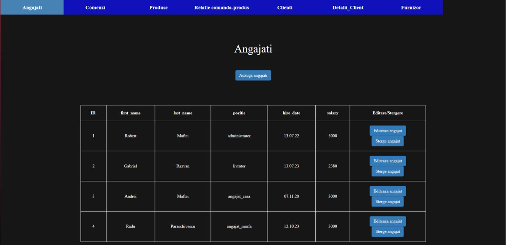
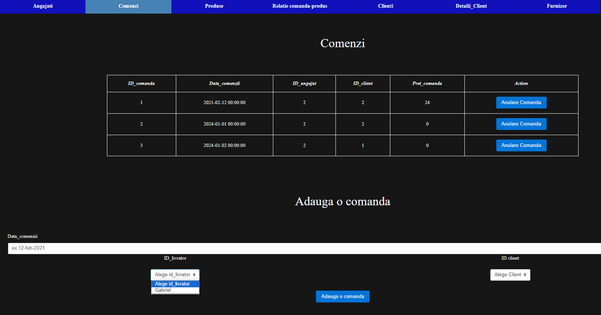
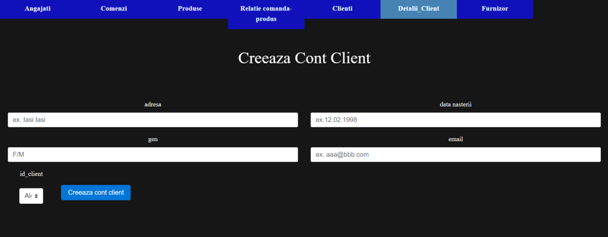

# School Supplies Store Management

This project is a web application designed to manage the activities of a school supplies store, focusing on order management by customer. The project involves the analysis, design, and implementation of a database and its associated application.


## Project Title
Management of a School Supplies Store


## Requirements and Organization

#### Customer Management
We need information such as:
- **Name and Surname**: For customer identification.
- **Address**: For home delivery.
- **Email Address**: To send news about products and services.
- **Date of Birth**: To send birthday wishes and potential discounts.

Two tables are used: `Client` and `Client Details`. The `Client` table allows quick searches by the customer's name.

#### Order Management
The `Order` table contains:
- **Order Date**: The date when the order was placed.
- **Price**: The total price of the order.

#### Employee Management
- Who is handling an order at any given time.
- The number of employees and their roles.
- The total sales per employee.

#### Product Management
- The products in stock at the time of order.

#### Supplier Management
- Replenishing stock.
- Handling complaints.

The `Supplier` table maintains records of the products each supplier provides and the quantity supplied.

## Technologies Used

- **Front-end**: HTML for creating pages and CSS for styling.
- **Back-end**: Python with Flask and `cx_Oracle` for connecting the front-end to the database.
- **Database**: SQL, designed using DataModeler and SQLDeveloper.

## Installation and Setup

1. Clone the repository:
   ```sh
   git clone https://github.com/Drexel7/OnlineLibrary.git
2. Navigate to the project directory:
   ```sh
   cd OnlineLibrary/main
3. Set up the database:

Configure your Oracle database and update the connection settings in the application.

4. Run the application:
   ```sh
   python main.py

## Front-end overwiew

- Employee table interface


- Order Table Interface


- Customer Registration Interface

